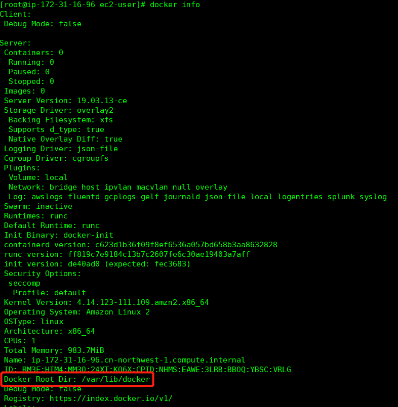
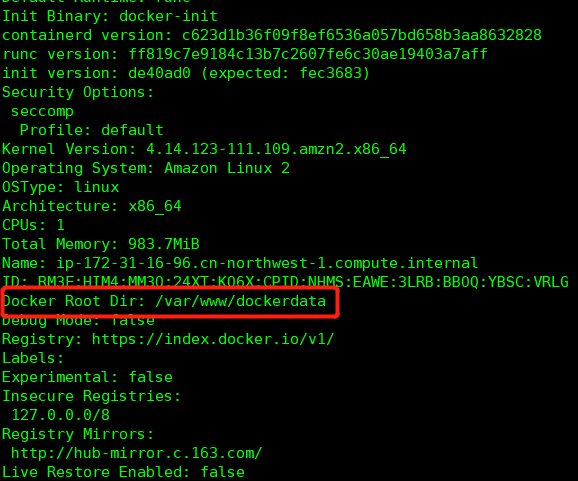

# Ubuntu修改Docker默认存储路径

## 0. 查看默认位置

输入
```
sudo docker info
```
可以查看程序信息，红框里就是默认的存储目录，把它改了就完事了


## 1. 修改

输入
```
sudo vi /etc/docker/daemon.json
```
默认情况下这个配置文件是没有的，这里实际也就是新建一个，然后写入以下内容
```
{
  "data-root": "/var/www/dockerdata"
}
```

## 2. 重启docker服务

输入
```
sudo systemctl restart docker
```
再次查看
```
sudo docker info
```


可以看到目录已经变成了设定的/var/www/dockerdata
